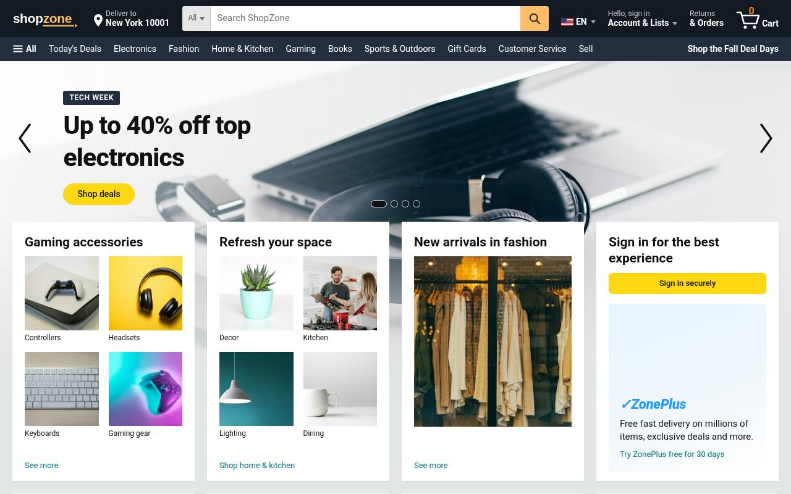

# ShopZone — Amazon-style E-commerce Landing Page

A polished, responsive e-commerce homepage inspired by the layout of large online marketplaces. ShopZone is a front-end portfolio project built with **plain HTML, CSS and vanilla JavaScript**. There is no framework and no build step, so it runs when you open `index.html` directly and also on GitHub Pages.

> **Live demo:** https://som-info.github.io/shopzone-amazon-clone/



## Features

- **Marketplace-style header:** logo, delivery-location picker (ZIP dialog, saved locally), category dropdown and search bar, account flyout, returns & orders, and a cart with a live item count.
- **Secondary navigation bar** with department links. It scrolls horizontally on smaller screens.
- **Hero carousel** that rotates automatically and has arrow buttons, dot navigation, keyboard arrows, touch swipe, pause on hover/focus and a gradient fade into the page.
- **Category cards** in a 4-per-row grid that overlaps the hero on desktop. Each card uses either a 2×2 tile layout or a single image.
- **Horizontally scrolling product rows** ("Today's deals" and "Best sellers") showing price, list price, discount badge, star rating, a ZonePlus delivery badge and an *Add to cart* button.
- **Cart** stored in `localStorage`. It includes a slide-in cart panel with quantity controls, a subtotal, a clear-cart action and sync across tabs.
- **Search & filter.** Search filters the product rows as you type. You can narrow results with the category dropdown or by clicking any category link.
- **Mobile hamburger menu** in a slide-in drawer with an overlay. The drawer closes with `Esc` and manages focus.
- **"Back to top"** bar with smooth scrolling and a multi-column dark footer.
- **Responsive** at 375px, 768px and 1280px+. **Accessible:** semantic landmarks, skip link, alt text, ARIA states and support for `prefers-reduced-motion`.

## Tech

- HTML5 (semantic markup)
- CSS3 (Grid, Flexbox, custom properties, scroll-snap, media queries)
- Vanilla JavaScript (ES5-compatible, no dependencies)

## Project structure

```
.
├── index.html
├── css/style.css
├── js/main.js
├── assets/
│   ├── logo.svg
│   ├── favicon.svg
│   └── img/          # optimized product, category and hero photos
└── README.md
```

## Run locally

Open `index.html` in a browser. You can also serve the folder:

```bash
python3 -m http.server 8080
# then visit http://localhost:8080
```

## Deploy to GitHub Pages

Push the repository to GitHub. Then open **Settings → Pages**, choose the `main` branch and the `/ (root)` folder, and save.

## Credits

- Photos from [Unsplash](https://unsplash.com) (Unsplash License), resized and stored locally in `assets/img/`.
- "ShopZone", "ZonePlus" and the logo are original names and artwork made for this demo. The layout is inspired by Amazon.com, but this project is not affiliated with or endorsed by Amazon or any other retailer. No real products are sold.

## Author

**Amir Namvar**, Full-Stack Web Developer. GitHub: [@som-info](https://github.com/som-info)
